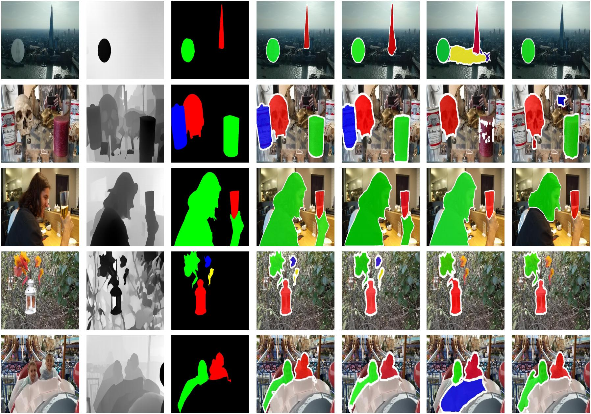

# SimpleDiffusion
## A Simple Conditional Diffusion Model for Multi-Modal Salient Object Detection


##  📢 Overview
<p align="justify">
Preserving the edge details of salient objects and promoting the alignment and fusion of cross-modal features have consistently been two primary objectives of multi-modal salient object detection (MSOD), which typically integrates depth or thermal modalities. Recently, with the remarkable success of diffusion models in the field of image generation, several studies have proposed a novel paradigm that reformulates RGB SOD or MSOD as a conditional mask-generation process powered by diffusion models. These methods leverage an iterative denoising process to progressively refine predictions under the guidance of salient feature conditions, thereby enhancing the edge details of the generated salient objects. 
However, existing diffusion-based MSOD models typically adopt backbone networks derived from pretrained Stable Diffusion architectures.
While these models can leverage the visual priors embedded in the pretrained weights to generate more refined salient objects, the high computational demands and large-scale architecture of Stable Diffusion make it clearly unsuitable for practical application scenarios.
Therefore, to address the practical demands of the MSOD task, including reducing model complexity, enhancing representational capacity, improving inference efficiency, and mitigating incorrect segmentations, we propose a straightforward and lightweight conditional diffusion architecture, complemented by a multi-modal feature rectification and fusion module as well as customized training and sampling strategies.
Comprehensive experiments on several MSOD datasets demonstrate that a simple yet efficient diffusion model can achieve state-of-the-art performance in both RGB-D SOD and RGB-T SOD while maintaining acceptable inference time. Notably, when extended to RGB-D salient instance segmentation, our model achieves competitive performance, setting new benchmarks for this challenging task.
</p>

## ⭐ Architecture
<p align="center">
    
</p>

<p align="justify">
The architecture design of our SimpleDiffusion. It consists of an Adaptive Cross-Modal Fusion Conditional Network for extracting multi-scale features as conditions, and a Latent Denoising Network for recovering clear mask predictions from the noised mask.
</p>

##  🚀 Modest Surprise
<p align="center">
    
</p>

<p align="justify">
The comparison results in the figure above, from left to right, are Image, Depth, GT, Ours, CalibNet, M2For, and RDPNet. Clearly, our SimpleDiffusion not only achieves excellent detection results in the RGB-D salient object generation domain but also delivers outstanding segmentation performance in RGB-D instance segmentation.
</p>

## ⬇ Datasets
**All datasets are available in public**.
* Download the LFSD from [Here](https://www.eecis.udel.edu/~nianyi/LFSD.htm)
* Download the NJUD from [Here](https://pan.baidu.com/s/1o-kOaDVqjV_druBHjD3NAA)
* Download the NLPR from [Here](https://pan.baidu.com/s/1pocKI_KEvqWgsB16pzO6Yw)
* Download the DUTLF from [Here](https://pan.baidu.com/s/1mhHAXLgoqqLQIb6r-k-hbA)
* Download the SIP from [Here](https://pan.baidu.com/s/14VjtMBn0_bQDRB0gMPznoA)
* Download the VT5000 from [Here](https://pan.baidu.com/s/196S1GcnI56Vn6fLO3oXb5Q) with password:y9jj
* Download the VT821 from [Here](https://drive.google.com/file/d/0B4fH4G1f-jjNR3NtQUkwWjFFREk/view?resourcekey=0-Kgoo3x0YJW83oNSHm5-LEw)
* Download the VT1000 from [Here](https://drive.google.com/file/d/1NCPFNeiy1n6uY74L0FDInN27p6N_VCSd/view)
  
## 🛠️  Dependencies
```bash
* pip install -r requirements.txt
```
## 📦 Checkpoint cache

By default, our [checkpoints](https://drive.google.com/file/d/1OynVRx5rY8IM0UwlIxEKVrH_ujcsOIlY/view?usp=drive_link)  are stored in Google Drive. 
You can click the link to download them and proceed directly with inference. 

## ⚙ Configurations

#### Training

```shell
accelerate launch train.py --config config/model.yaml --num_epoch=150 --batch_size=32 --num_workers=4 --results_folder './results'
```

#### Inference 
```shell
accelerate launch sample.py \
  --config config/model.yaml \
  --results_folder ${RESULT_SAVE_PATH} \
  --checkpoint ${CHECKPOINT_PATH} \
  --num_sample_steps 10 \
  --target_dataset NJU2K \
  --time_ensemble
```

## 💻 Testing on your images
### 📷 Prepare images
If you have images at hand, skip this step. Otherwise, download a few images from [Here](https://pan.baidu.com/s/1o-kOaDVqjV_druBHjD3NAA).


## 🎫 License

This work is licensed under the Apache License, Version 2.0 (as defined in the [LICENSE](LICENSE.txt)).

By downloading and using the code and model you agree to the terms in the  [LICENSE](LICENSE.txt).

[](https://www.apache.org/licenses/LICENSE-2.0)


